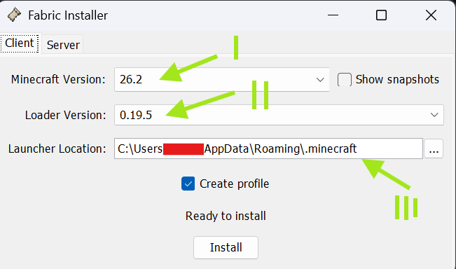
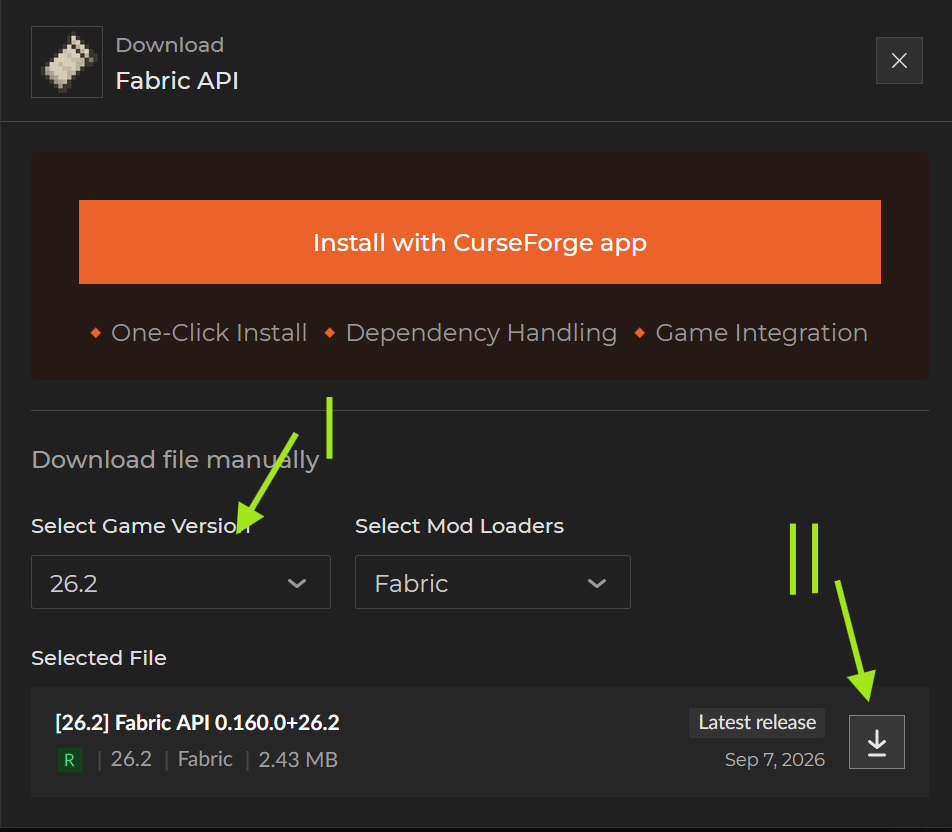
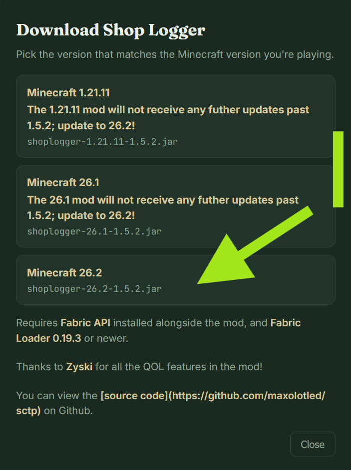
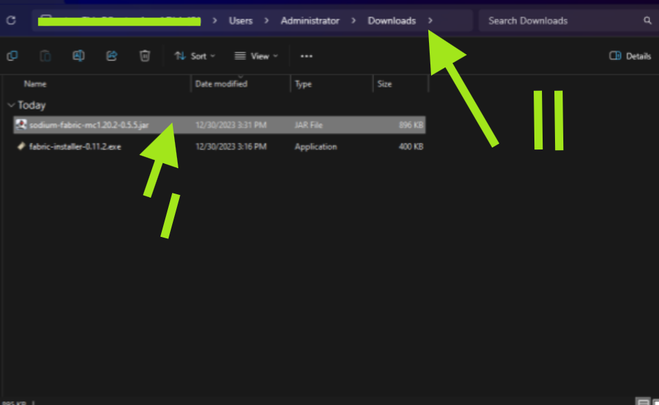

# How to install the SCTP mod?
::: details Table of Contents/Overview
[[toc]]
:::
::: warning Forge support
Forge is currently not supported. I am working on it, though!
:::
::: danger 1.21.11 & 26.1 EOL
Minecraft version 1.21.11 and 26.1 will no longer be supported after mod version 1.5.2, as Snailcraft has updated to 26.2 - please update!
:::

## Installing Fabric
::: warning Important:
This tutorial assumes you are using the default MC launcher. If you use Modrinth, Prism, Lunar, Feather, or a similar modded launcher, a different method may apply. I recommend you to use Google if that is the case.
:::
### Downloading & running the installer
Start by downloading and running the [official Fabric installer](https://fabricmc.net/use/installer/). You will see a screen like this:

::: tip I: Please select the Minecraft version. For the SCTP mod, select 26.2.
:::
::: tip II: Please select the most recent loader version available, usually selected by default.
:::
::: tip III: Please make sure the Launcher Location is correct. Usually, the default will be correct.
:::
::: tip IV: Make sure 'Create profile' is checked, and press 'Install'.
:::
### Launching Minecraft
Run the new profile created by the launcher first, so it can make the mods folder. Make sure the correct profile is selected (fabric-loader-XXX) and press play.

## Downloading the Fabric API
Next up, we will download the Fabric API - it's a mod that is required for the SCTP mod to function.
Start by going to the page on [curseforge](https://www.curseforge.com/minecraft/mc-mods/fabric-api).

::: tip I: Select the same game version you picked during the installation process, in this case 26.2.
:::
::: tip II: Press download, and put the file in a place you will remember for later.
:::
## Downloading the SCTP mod
Next, we will download the SCTP mod, called shoplogger. You can download it by going to the [sctp homepage](https://sctp.nl/) and pressing the Download button. 
::: tip I: Select the correct game version (26.2) and put it in a place to remember for later.
:::

::: info Safety
If you want to confirm the source code yourself before downloading, you can check out the [github repository](https://github.com/maxolotled/sctp).
:::
## Installing the mod files
For the last step, we need to put the mod files into the directory of the Fabric installation we made. Start by navigating to where you put the two downloaded mod files.

::: tip I: Copy the mod files: one for fabric API and one for SCTP.
:::
::: tip II: Navigate to the mod directory by pasting `%appdata%\.minecraft\mods` in your navigator bar (marked with the arrow), or open the folder via your launcher
:::
::: tip III: Paste the files into this mods folder.
:::
## Done
Congratulations, you have successfully installed the SCTP mod into your Minecraft, and can now start using it! Thank you for helping maintain the website.
Check out the [features](./features) now!